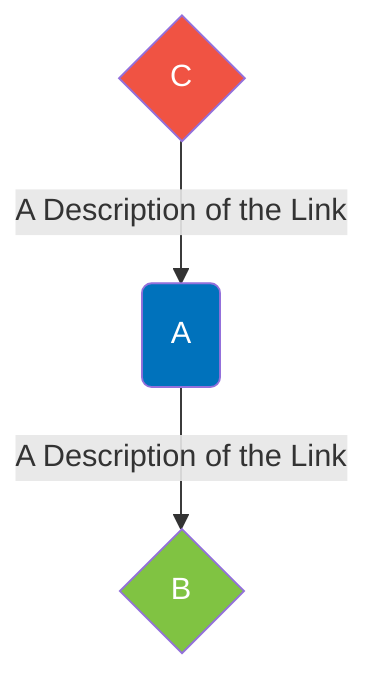

<a name="readme-top"></a>

[contributors-shield]: https://img.shields.io/github/contributors/IQTLabs/edgetech-axis-ptz-controller.svg?style=for-the-badge
[contributors-url]: https://github.com/IQTLabs/edgetech-axis-ptz-controller/graphs/contributors
[forks-shield]: https://img.shields.io/github/forks/IQTLabs/edgetech-axis-ptz-controller.svg?style=for-the-badge
[forks-url]: https://github.com/IQTLabs/edgetech-axis-ptz-controller/network/members
[stars-shield]: https://img.shields.io/github/stars/IQTLabs/edgetech-axis-ptz-controller.svg?style=for-the-badge
[stars-url]: https://github.com/IQTLabs/edgetech-axis-ptz-controller/stargazers
[issues-shield]: https://img.shields.io/github/issues/IQTLabs/edgetech-axis-ptz-controller.svg?style=for-the-badge
[issues-url]: https://github.com/IQTLabs/edgetech-axis-ptz-controller/issues
[license-shield]: https://img.shields.io/github/license/IQTLabs/edgetech-axis-ptz-controller.svg?style=for-the-badge
[license-url]: https://github.com/IQTLabs/edgetech-axis-ptz-controller/blob/master/LICENSE.txt
[product-screenshot]: images/screenshot.png

[Python]: https://img.shields.io/badge/python-000000?style=for-the-badge&logo=python
[Python-url]: https://www.python.org
[Poetry]: https://img.shields.io/badge/poetry-20232A?style=for-the-badge&logo=poetry
[Poetry-url]: https://python-poetry.org
[Docker]: https://img.shields.io/badge/docker-35495E?style=for-the-badge&logo=docker
[Docker-url]: https://www.docker.com

[![Contributors][contributors-shield]][contributors-url]
[![Forks][forks-shield]][forks-url]
[![Stargazers][stars-shield]][stars-url]
[![Issues][issues-shield]][issues-url]
[![MIT License][license-shield]][license-url]

<br />
<div align="center">
  <a href="https://iqtlabs.org/">
    
  </a>

<h1 align="center">Edgetech-Axis-Ptz-Controller</h1>

  <p align="center">
    This project provides a simple pan and tilt rate controller for
    AXIS Communications PTZ network cameras, exemplified by the axis
    <a
    href="https://www.axis.com/dam/public/8d/ba/86/datasheet-axis-m5525%E2%80%93e-ptz-network-camera-en-US-294608.pdf">
    AXIS M5525–E PTZ Network Camera</a>. The controller parameters can
    be customized through environment variables, or using an MQTT
    message published to a configuration topic. In addition, the
    controller subscribes to an MQTT message topic for orientation
    messages which set the yaw, pitch, and roll of the camera
    housing. Finally, the controller subscribes to an MQTT message
    topic for flight messages which describe the position of an
    aircraft at a time. Rigorous coordinate transformations using the
    WGS84, and quarternions to compute direction cosine matrices are
    used to compute the required pan and tilt rate of the camera to
    point at, and capture images of, the aircraft. Units of measure
    are meters, seconds, and degrees, and operation of the controller
    is extensively logged.
    <br/>
    <br/>
    <a href="https://github.com/IQTLabs/edgetech-axis-ptz-controller/pulls">Make Contribution</a>
    ·
    <a href="https://github.com/IQTLabs/edgetech-axis-ptz-controller/issues">Report Bug</a>
    ·
    <a href="https://github.com/IQTLabs/edgetech-axis-ptz-controller/issues">Request Feature</a>
  </p>
</div>

### Built With

[![Python][Python]][Python-url]
[![Poetry][Poetry]][Poetry-url]
[![Docker][Docker]][Docker-url]

## Getting Started

To run this repo, simply run:

```
docker-compose up
```

The AXIS PTZ network camera controller is containerized and
dependencies are managed using [poetry]("https://python-poetry.org").

### Prerequisites

Running this repo requires that you have
[Docker](https://www.docker.com) installed.

## Usage

Spinning up this system requires an MQTT server and this container to
be included in your `docker-compose.yml`. You can find an example of
this workflow in this repository's `docker-compose.yml`. Additionally,
some editing of relevant environment variables will be required based
upon your system's configuration of topics to subscribe to and MQTT
configuration. Examples of these environment variables can be found in
this repository's `template.axis-ptz-controller.env` file.

Copying the project `docker-compose` statements into a master
`docker-compose.yml` and `.env` files with your entire system of
containers is the preferred workflow. Find an application architecture
diagram example of how the usage of this module was envisioned below.

<!-- Use the Labs Brand Colors in Mermaid Diagrams: #80c342,  #181245,  #f9d308,  #0072bc, #f05343, #65cbe7, #6657d3, #5f6475, #ffee97, #d0d2d9 -->



## Roadmap

- TBA

See the [open
issues](https://github.com/IQTLabs/edgetech-axis-ptz-controller/issues)
for a full list of proposed features (and known issues).

## Contributing

1. Fork the Project
2. Create your Feature Branch (`git checkout -b dev`)
3. Commit your Changes (`git commit -m 'adding some feature'`)
4. Run (and make sure they pass):

```
black --diff --check *.py

pylint --disable=all --enable=unused-import *.py

mypy --allow-untyped-decorators --ignore-missing-imports --no-warn-return-any --strict --allow-subclassing-any *.py
```

If you do not have them installed, you can install them with `pip
install "black<23" pylint==v3.0.0a3 mypy==v0.991`.

5. Push to the Branch (`git push origin dev`)
6. Open a Pull Request

See `CONTRIBUTING.md` for more information.

## License

Distributed under the [Apache
2.0](https://github.com/IQTLabs/edgetech-audio-recorder/blob/main/LICENSE). See
`LICENSE.txt` for more information.

## Contact IQTLabs

  - Twitter: [@iqtlabs](https://twitter.com/iqtlabs)
  - Email: info@iqtlabs.org

See our other projects: [https://github.com/IQTLabs/](https://github.com/IQTLabs/)

<p align="right">(<a href="#readme-top">back to top</a>)</p>
