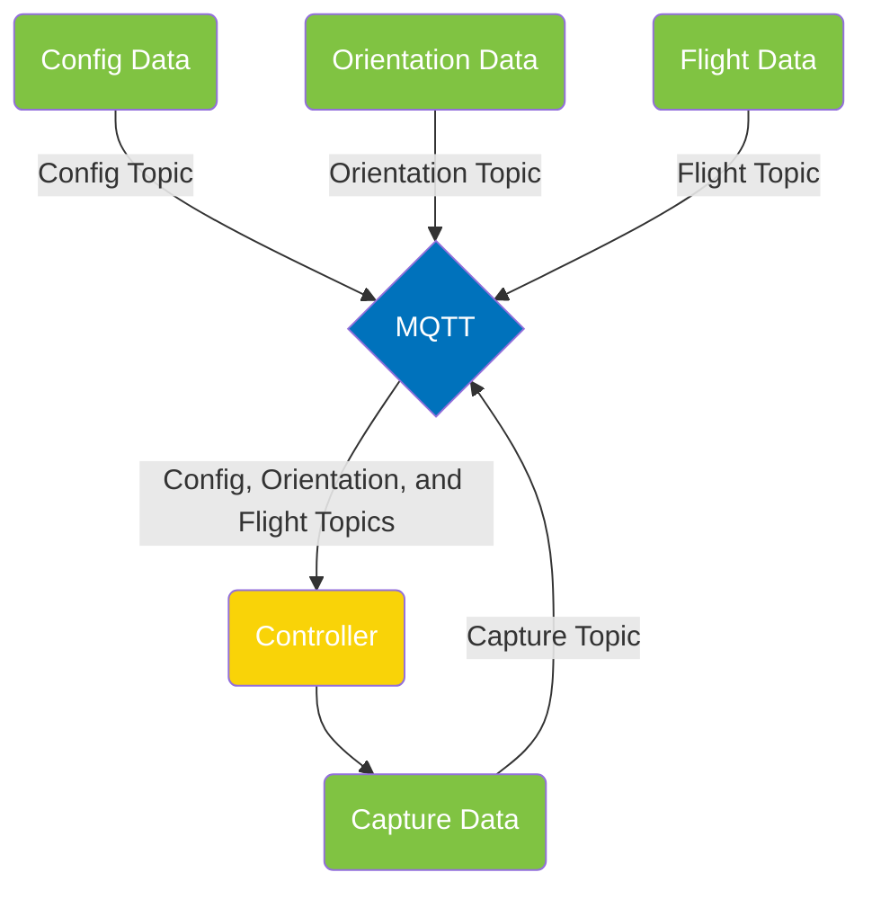

<a name="readme-top"></a>

[contributors-shield]: https://img.shields.io/github/contributors/IQTLabs/edgetech-axis-ptz-controller.svg?style=for-the-badge
[contributors-url]: https://github.com/IQTLabs/edgetech-axis-ptz-controller/graphs/contributors
[forks-shield]: https://img.shields.io/github/forks/IQTLabs/edgetech-axis-ptz-controller.svg?style=for-the-badge
[forks-url]: https://github.com/IQTLabs/edgetech-axis-ptz-controller/network/members
[stars-shield]: https://img.shields.io/github/stars/IQTLabs/edgetech-axis-ptz-controller.svg?style=for-the-badge
[stars-url]: https://github.com/IQTLabs/edgetech-axis-ptz-controller/stargazers
[issues-shield]: https://img.shields.io/github/issues/IQTLabs/edgetech-axis-ptz-controller.svg?style=for-the-badge
[issues-url]: https://github.com/IQTLabs/edgetech-axis-ptz-controller/issues
[license-shield]: https://img.shields.io/github/license/IQTLabs/edgetech-axis-ptz-controller.svg?style=for-the-badge
[license-url]: https://github.com/IQTLabs/edgetech-axis-ptz-controller/blob/master/LICENSE.txt
[product-screenshot]: images/screenshot.png

[Python]: https://img.shields.io/badge/python-000000?style=for-the-badge&logo=python
[Python-url]: https://www.python.org
[Poetry]: https://img.shields.io/badge/poetry-20232A?style=for-the-badge&logo=poetry
[Poetry-url]: https://python-poetry.org
[Docker]: https://img.shields.io/badge/docker-35495E?style=for-the-badge&logo=docker
[Docker-url]: https://www.docker.com

[![Contributors][contributors-shield]][contributors-url]
[![Forks][forks-shield]][forks-url]
[![Stargazers][stars-shield]][stars-url]
[![Issues][issues-shield]][issues-url]
[![MIT License][license-shield]][license-url]

<br />
<div align="center">
  <a href="https://iqtlabs.org/">
    
  </a>

<h1 align="center">Edgetech-Axis-Ptz-Controller</h1>

  <p align="center">
  This project provides a simple pan and tilt rate controller for AXIS
    Communications PTZ network cameras, exemplified by the <a
    href="https://www.axis.com/dam/public/8d/ba/86/datasheet-axis-m5525%E2%80%93e-ptz-network-camera-en-US-294608.pdf">AXIS
    M5525–E PTZ Network Camera</a>, for pointing the camera at an
    aircraft. The controller uses the position of the aircraft
    reported by aircraft broadcast ADS-B, and pan and tilt of the
    camera, to determine pan and tilt rates to follow the aircraft,
    adjust camera focus based on range to the aircraft from the
    camera, and periodically capture images of the aircraft.
    <br/>
    <br/>
    In more detail, the controller subscribes to an MQTT message topic
    for ADS-B, or flight, messages, which provide the aircraft
    latitude, longitude, altitude, and ground and vertical speeds at
    the message time which are used to compute geocentric, and
    topocentric position and velocity at the processing time using
    WGS84 and linear extrapolation. Camera housing orientation is
    represented by yaw, pitch, and roll, and these rotations are
    represented by quaternions which are used to compute direction
    cosine matrices for transformation between coordinate systems. The
    controller subscribes to an MQTT message topic for orientation
    messages, such as those published by the EdgeTech-Auto-Orienter,
    to set the yaw, pitch, and roll. The controller computes the pan
    and tilt of the camera required to point at the aircraft, queries
    the camera for its current pan and tilt, then commands a pan and
    tilt rate proportional to the pan and tilt differences. The
    controller assumes camera focus varies linearly with range to the
    aircraft from the camera, then computes and sets focus whenever a
    flight message is received. The controller begins capturing images
    whenever a new aircraft is encountered, and stops capturing images
    if a flight message has not been received in a specified
    interval. All controller parameters can be customized through
    environment variables, or using an MQTT message published to a
    configuration topic. Units of measure are meters, seconds, and
    degrees, and operation of the controller is extensively logged.
    <br/>
    <br/>
    <a href="https://github.com/IQTLabs/edgetech-axis-ptz-controller/pulls">Make Contribution</a>
    ·
    <a href="https://github.com/IQTLabs/edgetech-axis-ptz-controller/issues">Report Bug</a>
    ·
    <a href="https://github.com/IQTLabs/edgetech-axis-ptz-controller/issues">Request Feature</a>
  </p>
</div>

### Built With

[![Python][Python]][Python-url]
[![Poetry][Poetry]][Poetry-url]
[![Docker][Docker]][Docker-url]

## Getting Started

To run this repo, simply run:

```
docker-compose up
```

The AXIS PTZ network camera controller is containerized and
dependencies are managed using [poetry]("https://python-poetry.org").

### Prerequisites

Running this repo requires that you have
[Docker](https://www.docker.com) installed.

## Usage

This module is designed to be used in concert with other modules to
build a complete tracking system. [SkyScan]() is an example of that.
 Checkout the `docker-compose.yml` in that repo to see how these modules
 can be connected together. The configuration for the system is stored in environment files that are loaded
 in when it is started up. Examples of the different environment files
 are included in the SkyScan repo, configure them to match your setup.




## Roadmap

- TBA

See the [open
issues](https://github.com/IQTLabs/edgetech-axis-ptz-controller/issues)
for a full list of proposed features (and known issues).

## Contributing

1. Fork the Project
2. Create your Feature Branch (`git checkout -b dev`)
3. Commit your Changes (`git commit -m 'adding some feature'`)
4. Run (and make sure they pass):

```
black --diff --check *.py

pylint --disable=all --enable=unused-import *.py

mypy --allow-untyped-decorators --ignore-missing-imports --no-warn-return-any --strict --allow-subclassing-any *.py
```

If you do not have them installed, you can install them with `pip
install "black<23" pylint==v3.0.0a3 mypy==v0.991`.

5. Push to the Branch (`git push origin dev`)
6. Open a Pull Request

See `CONTRIBUTING.md` for more information.

## License

Distributed under the [Apache
2.0](https://github.com/IQTLabs/edgetech-audio-recorder/blob/main/LICENSE). See
`LICENSE.txt` for more information.

## Contact IQTLabs

  - Twitter: [@iqtlabs](https://twitter.com/iqtlabs)
  - Email: info@iqtlabs.org

See our other projects: [https://github.com/IQTLabs/](https://github.com/IQTLabs/)

<p align="right">(<a href="#readme-top">back to top</a>)</p>
